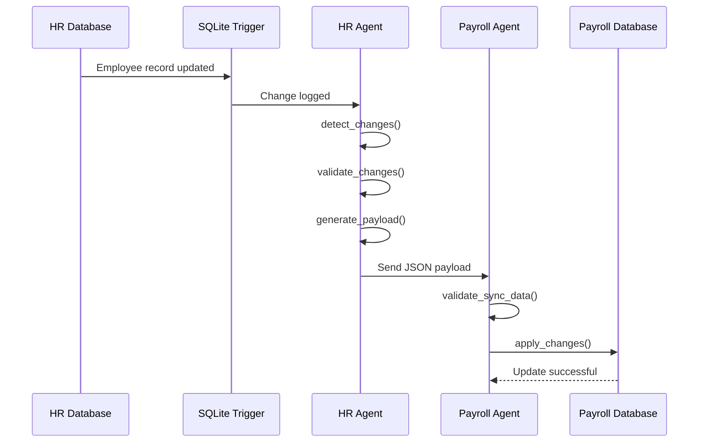

## Architecture

<p align="center">
  
</p>

The platform uses MCP servers and workflow-driven agents to synchronize employee updates between HR and Payroll systems.

### Architecture Components

#### HR System

Stores employee information and serves as the source of truth for employee data.

#### SQLite Triggers

Automatically capture employee record modifications and write change events into a dedicated change log table.

#### HR MCP Server

Provides tools responsible for:

* Detecting employee changes
* Validating updates
* Generating synchronization payloads

#### HR Agent

Coordinates change processing by invoking MCP tools and preparing validated employee updates for synchronization.

#### Synchronization Payload

Structured JSON payload containing employee updates, change metadata, and processing information.

#### Payroll Agent

Receives synchronization requests and coordinates payroll-side validation and update workflows.

#### Payroll MCP Server

Provides tools responsible for:

* Receiving synchronization payloads
* Validating incoming data
* Applying employee updates

#### Payroll Database

Stores synchronized employee records used for payroll processing.

---

## Synchronization Flow



---

## Example Synchronization Payload

```json
{
  "employee_id": 1001,
  "change_type": "salary_update",
  "old_salary": 95000,
  "new_salary": 98000,
  "timestamp": "2026-06-18T10:30:00Z",
  "status": "pending"
}
```

---

## Screenshots

### HR Database

*Add screenshot showing employee records before update.*

### Change Log

*Add screenshot showing trigger-generated change records.*

### Generated Payload

*Add screenshot showing synchronization payload.*

### Payroll Database

*Add screenshot showing updated payroll record after synchronization.*

---

## Running the Project

### 1. Clone Repository

```bash
git clone https://github.com/<your-username>/hr-payroll-sync-platform.git
cd hr-payroll-sync-platform
```

### 2. Create Virtual Environment

```bash
python -m venv .venv
```

Windows

```bash
.venv\Scripts\activate
```

Linux / macOS

```bash
source .venv/bin/activate
```

### 3. Install Dependencies

```bash
pip install -r requirements.txt
```

### 4. Initialize Databases

```bash
python scripts/init_hr_db.py
python scripts/init_payroll_db.py
```

### 5. Start MCP Servers

```bash
python hr_mcp_server.py
```

Open a second terminal:

```bash
python payroll_mcp_server.py
```

### 6. Simulate Employee Changes

```bash
python scripts/test_changes.py
```

### 7. Run Synchronization Workflow

```bash
python hr_agent.py
python payroll_agent.py
```

---

## Challenges & Learnings

### Challenge 1

Detecting employee changes without continuously scanning the entire employee table.

**Solution:** Implemented SQLite triggers and a dedicated change log table to capture updates as they occur.

### Challenge 2

Ensuring invalid employee updates are not propagated to Payroll.

**Solution:** Added validation layers before payload generation and before payroll updates.

### Challenge 3

Maintaining clear separation between HR and Payroll responsibilities.

**Solution:** Exposed functionality through MCP tools and separate agents to simulate independent systems.


```
```
