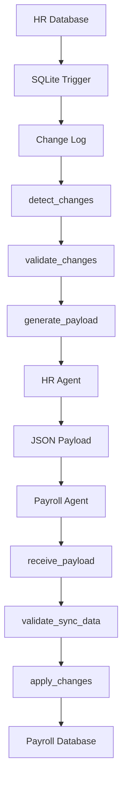
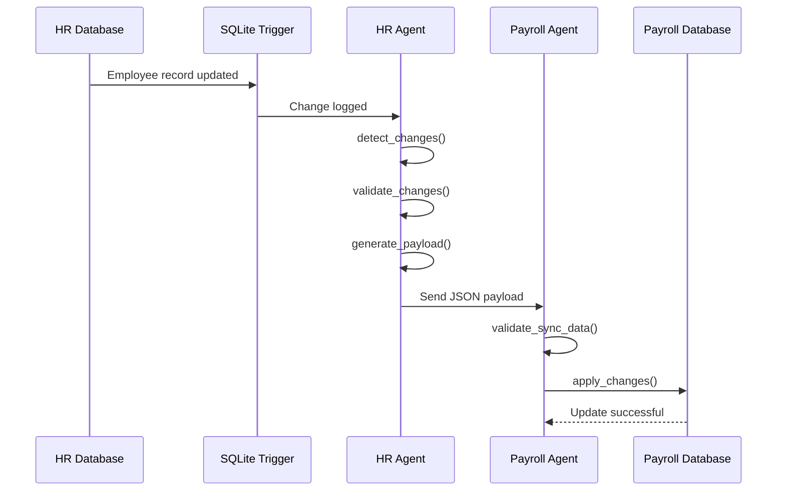

# Multi-Agent HR-Payroll Synchronization Platform

A prototype integration platform that demonstrates how employee data changes can be automatically synchronized between HR and Payroll systems using Model Context Protocol (MCP), LangChain, and Python.

The project simulates a common enterprise workflow where employee records maintained in an HR system must remain consistent with records stored in a Payroll system. It detects employee updates, validates business rules, generates synchronization payloads, and applies approved changes to the target system.

---

# Architecture

The platform synchronizes employee updates between independent HR and Payroll systems using MCP servers, workflow agents, and structured JSON payloads.



### Architecture Components

| Component          | Responsibility                                            |
| ------------------ | --------------------------------------------------------- |
| HR Database        | Stores employee information and acts as the source system |
| SQLite Trigger     | Automatically captures employee record changes            |
| Change Log         | Stores pending employee updates for processing            |
| detect_changes     | Retrieves unprocessed employee updates                    |
| validate_changes   | Validates employee data against business rules            |
| generate_payload   | Creates structured synchronization payloads               |
| HR Agent           | Coordinates HR-side synchronization workflow              |
| JSON Payload       | Transfer format used between systems                      |
| Payroll Agent      | Handles incoming synchronization requests                 |
| receive_payload    | Receives employee update payloads                         |
| validate_sync_data | Validates incoming payroll updates                        |
| apply_changes      | Applies approved changes to Payroll records               |
| Payroll Database   | Stores synchronized payroll information                   |

---


## Business Problem

Organizations often maintain employee information across multiple applications. When changes such as salary revisions, department transfers, designation updates, or employee status changes occur in the HR system, those updates must also be reflected in Payroll.

Manual synchronization can lead to:

* Data inconsistencies between systems 
* Delayed payroll processing
* Increased operational effort
* Human errors during data updates

This project demonstrates an automated approach to detecting and synchronizing employee changes between independent systems.

---

## Solution Overview

The platform consists of two independent systems:

### HR System

Responsible for:

* Managing employee records
* Detecting employee data changes
* Validating updates
* Generating synchronization payloads

### Payroll System

Responsible for:

* Receiving employee updates
* Validating incoming data
* Applying approved changes
* Maintaining synchronized payroll records

Communication between systems is implemented through MCP tools and structured JSON payloads.

---


## Synchronization Flow



### End-to-End Workflow

1. Employee information is updated in the HR database.
2. SQLite triggers automatically capture the modification.
3. The change is recorded in the change log table.
4. The HR Agent retrieves pending updates using MCP tools.
5. Employee records are validated against business rules.
6. A structured JSON synchronization payload is generated.
7. The Payroll Agent receives the payload.
8. Payroll-side validation checks are executed.
9. Approved changes are applied to the Payroll database.
10. Employee records remain synchronized across both systems.

---

## Key Features

### Change Detection

Implemented SQLite triggers to automatically capture employee record updates and store them in a dedicated change log table.

Captured events include:

* Employee salary updates
* Department changes
* Designation updates
* Employee information modifications

### Validation Layer

Before synchronization, employee updates are validated against business rules to prevent invalid data from reaching the Payroll system.

Example validations:

* Employee ID must exist
* Salary values must be valid
* Required employee fields cannot be empty
* Duplicate change records are ignored

### Payload Generation

Validated employee updates are transformed into structured JSON payloads containing:

* Employee information
* Change type
* Updated values
* Synchronization metadata
* Processing timestamps

### Payroll Synchronization

The Payroll system receives incoming payloads, performs validation checks, and applies approved updates to maintain data consistency.

### MCP Tool Integration

#### HR MCP Server

| Tool             | Purpose                           |
| ---------------- | --------------------------------- |
| detect_changes   | Retrieve pending employee updates |
| validate_changes | Validate employee records         |
| generate_payload | Create synchronization payload    |

#### Payroll MCP Server

| Tool               | Purpose                  |
| ------------------ | ------------------------ |
| receive_payload    | Receive incoming updates |
| validate_sync_data | Validate payload data    |
| apply_changes      | Update Payroll database  |

---

## Example Use Case

### Scenario

An HR administrator updates an employee salary.

### Before Update

```json
{
  "employee_id": 1001,
  "name": "John Doe",
  "salary": 95000
}
```

### After Update

```json
{
  "employee_id": 1001,
  "name": "John Doe",
  "salary": 98000
}
```

### Example Synchronization Payload

```json
{
  "employee_id": 1001,
  "change_type": "salary_update",
  "old_salary": 95000,
  "new_salary": 98000,
  "timestamp": "2026-06-18T10:30:00Z",
  "status": "pending"
}
```

Result:

The employee's payroll record is automatically updated to reflect the revised salary.

---

## Project Structure

```text
hr-payroll-sync-platform/

├── data/
│   ├── hr_system.db
│   ├── payroll_system.db
│   └── sync_payload.json
│
├── scripts/
│   ├── init_hr_db.py
│   ├── init_payroll_db.py
│   └── test_changes.py
│
├── hr_mcp_server.py
├── payroll_mcp_server.py
├── hr_agent.py
├── payroll_agent.py
│
├── requirements.txt
├── .env.example
├── README.md
└── .gitignore
```

---

## Getting Started

### Clone Repository

```bash
git clone https://github.com/<your-username>/hr-payroll-sync-platform.git
cd hr-payroll-sync-platform
```

### Create Virtual Environment

```bash
python -m venv .venv
```

Windows

```bash
.venv\Scripts\activate
```

Linux/macOS

```bash
source .venv/bin/activate
```

### Install Dependencies

```bash
pip install -r requirements.txt
```

### Initialize Databases

```bash
python scripts/init_hr_db.py
python scripts/init_payroll_db.py
```

### Start MCP Servers

Terminal 1

```bash
python hr_mcp_server.py
```

Terminal 2

```bash
python payroll_mcp_server.py
```

### Simulate Employee Changes

```bash
python scripts/test_changes.py
```

### Run Synchronization Workflow

```bash
python hr_agent.py
python payroll_agent.py
```

---

## Technology Stack

* Python
* LangChain
* Model Context Protocol (MCP)
* SQLite
* JSON
* Git

---

## Technical Concepts Demonstrated

* MCP Server Development
* Tool-Based System Integration
* Workflow Automation
* Change Data Capture (CDC)
* Database Triggers
* Agent-Based Task Execution
* Data Validation Pipelines
* Cross-System Data Synchronization
* Structured Payload Generation

---

---

## Learning Outcomes

Through this project, I gained practical experience with:

* Designing MCP servers and tools
* Building workflow-driven applications
* Implementing change detection using database triggers
* Creating validation and synchronization pipelines
* Simulating enterprise system integration scenarios
* Managing data consistency across independent systems
* Understanding MCP-based tool communication patterns
* Structuring agent-driven workflows for business automation

```
```
